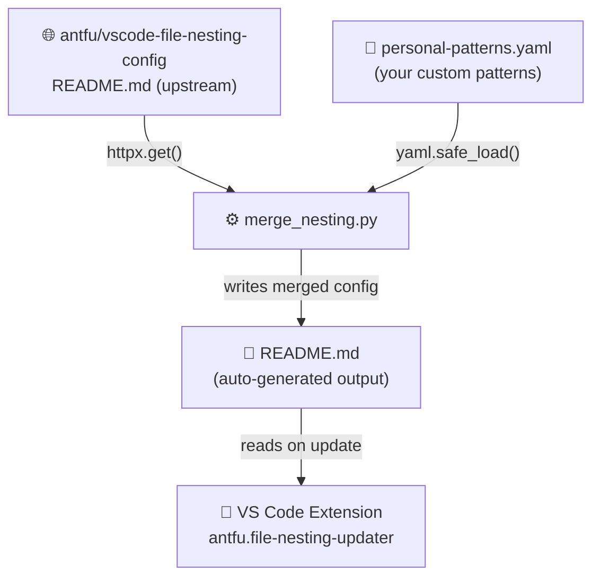
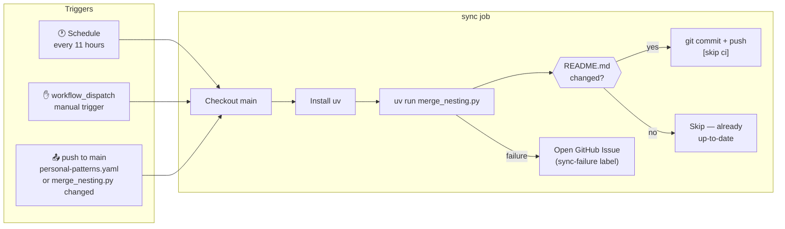

# How It Works

## Overview

This repo contains a single Python script ([`merge_nesting.py`](../merge_nesting.py)) that:

1. Fetches the latest `README.md` from the upstream community repo
   [`antfu/vscode-file-nesting-config`](https://github.com/antfu/vscode-file-nesting-config)
2. Parses the `jsonc` block which contains all nesting patterns
3. Merges personal patterns from [`personal-patterns.yaml`](../personal-patterns.yaml) on top
   (personal entries override upstream entries with the same key; new keys are appended)
4. Renders the merged `README.md` — which is what the VS Code extension reads



---

## Trigger Conditions

The GitHub Actions workflow (`.github/workflows/sync.yml`) runs in three situations:



### When does README.md actually change?

| Situation | Workflow runs? | README.md updated? |
|-----------|---------------|-------------------|
| Upstream antfu repo gets new patterns | ✅ (schedule) | ✅ yes |
| You push a change to `personal-patterns.yaml` | ✅ (push trigger) | ✅ yes |
| You push a change to `merge_nesting.py` | ✅ (push trigger) | ✅ if output differs |
| Nothing changed | ✅ (schedule) | ❌ skip — `git diff` is clean |
| Workflow commits README.md | triggered by push | ❌ `[skip ci]` prevents loop |

---

## Adding Custom Patterns

Edit [`personal-patterns.yaml`](../personal-patterns.yaml):

```yaml
patterns:
  # Override an upstream entry (same key → replaces the upstream value)
  - key: "*.env"
    patterns:
      - ".env"
      - ".env.*"
      - "my-extra-env-file"

  # Append a new entry (key not in upstream)
  - key: "mise.toml"
    patterns:
      - ".mise.toml"
      - "*.mise.toml"
      - "mise.local.toml"
```

Commit and push — the workflow triggers automatically within seconds.

---

## VS Code Extension Setup

Install [antfu.file-nesting-updater](https://marketplace.visualstudio.com/items?itemName=antfu.file-nesting-updater)
from the VS Code Marketplace, then add to your `settings.json`:

```jsonc
{
  // Point the extension at this fork instead of the upstream repo
  "fileNestingUpdater.upstreamRepo": "tobiashochguertel/vscode-file-nesting-config",
  "fileNestingUpdater.upstreamBranch": "main"
}
```

The extension checks for updates every 12 hours and rewrites `explorer.fileNesting.patterns`
in your user `settings.json` from the `README.md` of whichever repo you point it at.

---

## Local Development

Requires [uv](https://docs.astral.sh/uv/) and [Task](https://taskfile.dev).

```bash
# Preview the merged README without writing to disk
task dry-run

# Write README.md locally
task merge

# Lint / format the script
task lint
task format

# Manually trigger the GitHub Actions workflow
task trigger

# Watch the running workflow
task watch
```

---

## Repository Structure

```
.
├── merge_nesting.py          # PEP 723 UV script — the merge logic
├── personal-patterns.yaml    # ✏️  Edit this to add your custom patterns
├── README.md                 # Auto-generated — do not edit directly
├── Taskfile.yml              # Developer task runner
├── docs/
│   ├── README.md             # Docs index
│   └── how-it-works.md       # This file
└── .github/
    └── workflows/
        └── sync.yml          # GitHub Actions — schedule + push triggers
```
